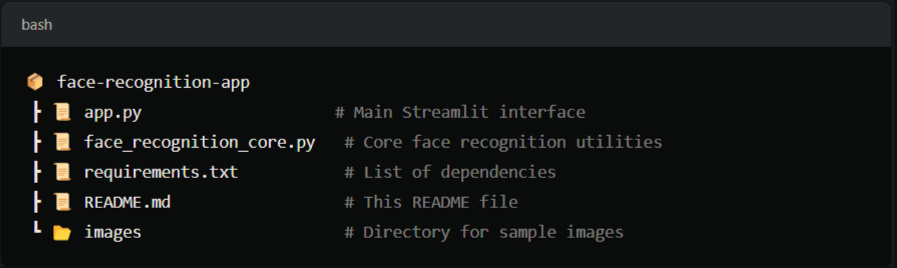

# Face Recognition System with Streamlit

Welcome to the Face Recognition System built using Streamlit and OpenCV! This project offers an interactive interface to register new faces and recognize existing faces from uploaded images. It leverages the powerful `face_recognition` library, making it easy to build robust facial recognition applications.


## 📄 Features

- Register Face: Upload an image of a new face and assign a name to it. The system will store the face encoding for future recognition.
- Recognize Face: Upload an image, and the system will detect and recognize registered faces, displaying names and confidence levels.
- Real-time Feedback: Receive instant feedback on registration and recognition operations.
- Simple and Intuitive UI: Easy-to-use interface with a clear workflow to interact with the system.

## 📂 Project Structure

<p align="center">  

</p>

### File Descriptions

- app.py: The main file for the Streamlit interface, handling user interactions, image uploads, and displaying results.
- face_recognition_core.py: Core utility functions for registering faces and performing face recognition.
- requirements.txt: Specifies the dependencies needed to run this project.

1. Clone the repository:
   ```sh
   git clone https://github.com/muhkartal/fr-photo
   ```
2. Install the required Python packages:

   ```sh
   pip install -r requirements.txt
   ```

   > If you do not have a `requirements.txt file`, manually install the required libraries with:

   ```sh
   pip install streamlit pandas opencv face_recognition PIL
   ```

3. Run the Application
   ```sh
   python main.py
   ```

## 🔑 Key Considerations

- Ensure that the uploaded image for face registration is clear and contains only one face for better results.
- Face recognition accuracy may vary depending on the image quality and similarity of faces.

## 🐞 Troubleshooting

- If the system fails to detect a face during registration, try using a higher-quality image with better lighting.
- For any dependency issues, make sure to install the specific versions listed in requirements.txt.

## 🤝 Contributing

Contributions are welcome! Please follow these steps:

- Fork the repository.
- Create a new branch (feature-branch).
- Make your changes and commit them with clear messages.
- Push to the branch and open a Pull Request.
